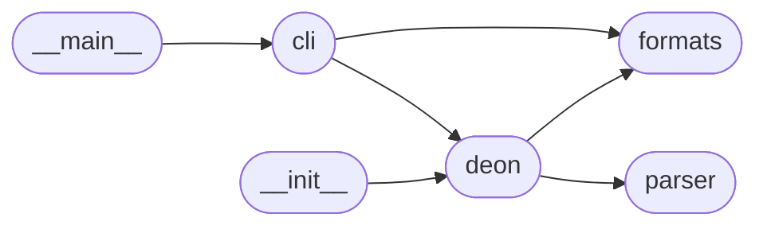

# Code Overview

[_Documentation generated by Documatic_](https://www.documatic.com)

<!---Documatic-section-Codebase Structure Python-start--->
## Codebase Structure Python

The codebase has a flat structure, with 6 code files.

<!---Documatic-block-system_architecture-start--->

<!---Documatic-block-system_architecture-end--->

# #
<!---Documatic-section-Codebase Structure Python-end--->

<!---Documatic-section-Key Objects-start--->
## Key Objects

There are exposed imports at level-0
from the source directory (deon)

<!---Documatic-block-deo-start--->

	
<code>deo</code> (Click to Expand!)

* `deon.deon.ExtensionException`
* `deon.deon.FormatException`
* `deon.deon.create`

<!---Documatic-block-deo-end--->

# #
<!---Documatic-section-Key Objects-end--->

<!---Documatic-section-Important Functions-start--->
## Important Functions

<!---Documatic-block-important_funcs-start--->
<!---Documatic-block-most_used_funcs-start--->
### Most Utilised Functions

* [deon.deon.create](4-deon_deon.md#deon.deon.create) (2 times)
* [deon.cli.main](3-deon_cli.md#deon.cli.main) (1 times)
<!---Documatic-block-most_used_funcs-end--->

<!---Documatic-block-end_user_funcs-start--->
### End User Exposed Functions

* deon.deon.FormatException
* [deon.cli.main](3-deon_cli.md#deon.cli.main)
* deon.deon.ExtensionException
* [deon.deon.create](4-deon_deon.md#deon.deon.create)
<!---Documatic-block-end_user_funcs-end--->
<!---Documatic-block-important_funcs-end--->

# #
<!---Documatic-section-Important Functions-end--->

<!---Documatic-section-File IO-start--->
## File IO

<!---Documatic-block-file_io-start--->
The following files have file read operations

<!---Documatic-block-deon-start--->

	
<code>deon</code> (Click to Expand!)

* deon.formats
* deon.parser

<!---Documatic-block-deon-end--->

The following files have file write operations

<!---Documatic-block-deon-start--->

	
<code>deon</code> (Click to Expand!)

* deon.formats

<!---Documatic-block-deon-end--->
<!---Documatic-block-file_io-end--->

# #
<!---Documatic-section-File IO-end--->

<!---Documatic-section-Class Hierarchy-start--->
## Class Hierarchy

<!---Documatic-block-deon.formats.Format-start--->

	
<code>deon.formats.Format</code> (Click to Expand!)

* deon.formats.Html
* deon.formats.Markdown
* deon.formats.Rst

<!---Documatic-block-deon.formats.Format-end--->

<!---Documatic-block-deon.formats.JupyterNotebook-start--->

	
<code>deon.formats.JupyterNotebook</code> (Click to Expand!)

* deon.formats.JupyterNotebookMulticell

<!---Documatic-block-deon.formats.JupyterNotebook-end--->

<!---Documatic-block-deon.formats.Markdown-start--->

	
<code>deon.formats.Markdown</code> (Click to Expand!)

* deon.formats.JupyterNotebook

<!---Documatic-block-deon.formats.Markdown-end--->

<!---Documatic-block-dict-start--->

	
<code>dict</code> (Click to Expand!)

* deon.formats.JsonDict

<!---Documatic-block-dict-end--->

<!---Documatic-block-object-start--->

	
<code>object</code> (Click to Expand!)

* deon.formats.Format
* deon.parser.Checklist
* deon.parser.Line
* deon.parser.Section

<!---Documatic-block-object-end--->

# #
<!---Documatic-section-Class Hierarchy-end--->

[_Documentation generated by Documatic_](https://www.documatic.com)