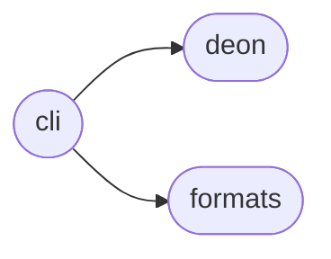
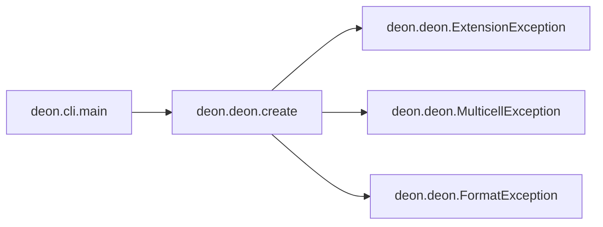

# Deon Cli

[_Documentation generated by Documatic_](https://www.documatic.com)

<!---Documatic-section-Codebase Structure-start--->
## Codebase Structure

<!---Documatic-block-system_architecture-start--->

<!---Documatic-block-system_architecture-end--->

# #
<!---Documatic-section-Codebase Structure-end--->

<!---Documatic-section-deon.cli.main-start--->
## [deon.cli.main](3-deon_cli.md#deon.cli.main)

<!---Documatic-section-main-start--->


### Object Calls

* [deon.deon.create](4-deon_deon.md#deon.deon.create)

<!---Documatic-block-deon.cli.main-start--->
<details>
	<summary><code>deon.cli.main</code> code snippet</summary>

```python
@click.command('deon')
@click.option('--checklist', '-l', default=None, type=click.Path(exists=True), help='Override default checklist file with a path to a custom checklist.yml file.')
@click.option('--format', '-f', 'output_format', default=None, type=str, help='Output format. Default is "markdown". ' + 'Can be one of [{}]. '.format(', '.join(EXTENSIONS.values())) + 'Ignored and file extension used if --output is passed.')
@click.option('--output', '-o', default=None, type=click.Path(), help='Output file path. Extension can be one of [{}]. '.format(', '.join(EXTENSIONS.keys())) + 'The checklist is appended if the file exists.')
@click.option('--overwrite', '-w', is_flag=True, default=False, help='Overwrite output file if it exists. ' + 'Default is False, which will append to existing file.')
@click.option('--multicell', '-m', is_flag=True, default=False, help='For use with Jupyter format only. ' + 'Write checklist with multiple cells, one item per cell. ' + 'Default is False, which will write the checklist in a single cell.')
def main(checklist, output_format, output, overwrite, multicell):
    try:
        result = create(checklist, output_format, output, overwrite, multicell)
    except ExtensionException:
        with click.get_current_context() as ctx:
            msg = 'Output requires a file name with a supported extension.\n\n'
            raise click.ClickException(msg + ctx.get_help())
    except FormatException:
        with click.get_current_context() as ctx:
            msg = f'File format {output_format} is not supported.\n\n'
            raise click.ClickException(msg + ctx.get_help())
    except MulticellException:
        with click.get_current_context() as ctx:
            msg = f'Multicell is for use with jupyter format only. You used: {output_format}.\n\n'
            raise click.ClickException(msg + ctx.get_help())
    else:
        if result:
            click.echo(result)
        else:
            click.echo(f'Checklist successfully written to file {output}.')
```
</details>
<!---Documatic-block-deon.cli.main-end--->
<!---Documatic-section-main-end--->

# #
<!---Documatic-section-deon.cli.main-end--->

[_Documentation generated by Documatic_](https://www.documatic.com)