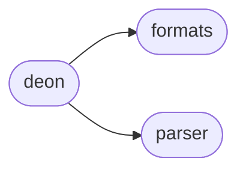

# Deon Deon

[_Documentation generated by Documatic_](https://www.documatic.com)

<!---Documatic-section-Codebase Structure-start--->
## Codebase Structure

<!---Documatic-block-system_architecture-start--->

<!---Documatic-block-system_architecture-end--->

# #
<!---Documatic-section-Codebase Structure-end--->

<!---Documatic-section-deon.deon.create-start--->
## [deon.deon.create](4-deon_deon.md#deon.deon.create)

<!---Documatic-section-create-start--->


### Object Calls

* deon.deon.ExtensionException
* deon.deon.MulticellException
* deon.deon.FormatException

<!---Documatic-block-deon.deon.create-start--->
<details>
	<summary><code>deon.deon.create</code> code snippet</summary>

```python
def create(checklist, output_format, output, overwrite, multicell):
    cl_path = Path(checklist) if checklist else DEFAULT_CHECKLIST
    cl = Checklist.read(cl_path)
    output = Path(output) if output else None
    if output:
        ext = output.suffix.lower()
        if ext in EXTENSIONS.keys():
            output_format = EXTENSIONS[ext]
        else:
            raise ExtensionException(ext)
    elif output_format:
        if output_format not in FORMATS:
            raise FormatException(output_format)
    else:
        output_format = 'markdown'
    if multicell:
        if not output_format == 'jupyter':
            raise MulticellException(output_format)
        output_format = 'jupyter-multicell'
    template = FORMATS[output_format](cl)
    if output:
        template.write(output, overwrite=overwrite)
    else:
        return template.render()
```
</details>
<!---Documatic-block-deon.deon.create-end--->
<!---Documatic-section-create-end--->

# #
<!---Documatic-section-deon.deon.create-end--->

[_Documentation generated by Documatic_](https://www.documatic.com)